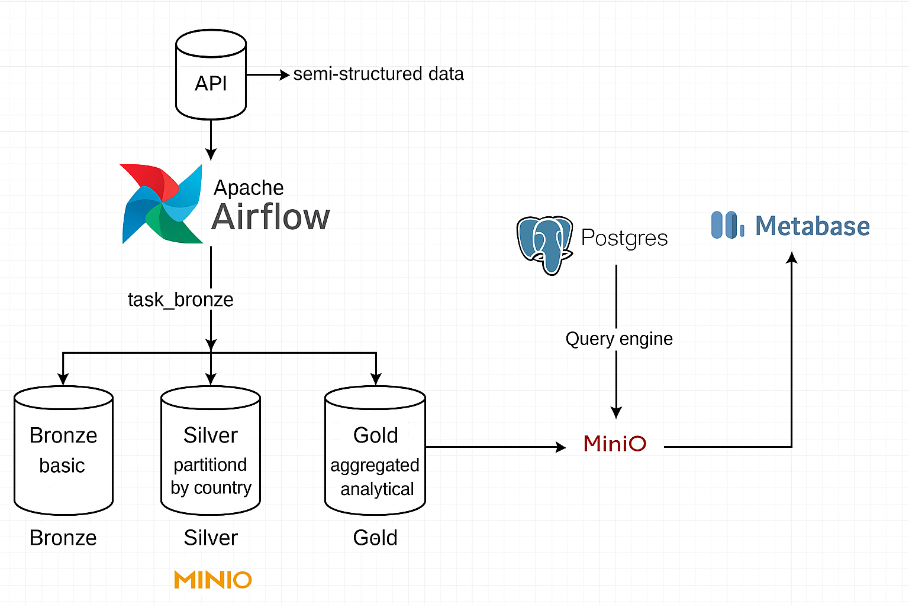
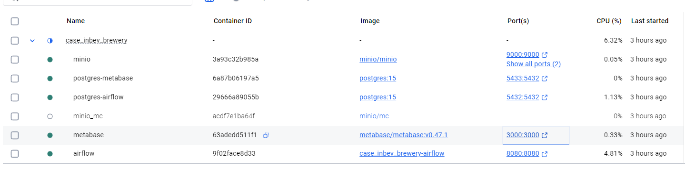
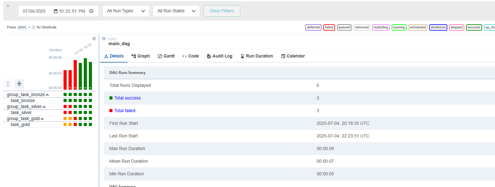
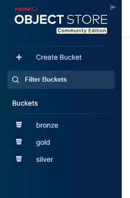

# BEES Data Engineering 
## 🍺 Data Project – Breweries Case

Este repositório contém a estrutura de um projeto de dados, tendo por objetivo a avaliação das habilidades em consumir dados de uma API, transformando-os e persistindo-os em um data lake seguindo a arquitetura medalhão com três camadas: dados brutos(Bronze), dados selecionados particionado por localização(Silver) e uma camada analítica agregada(Gold).  Integrando o Apache Airflow, Minio, Postgres e Metabase. Utilizando uma infra-estrutura de conteninerização(Docker), boas praticas de programação(Python) e Documentação, alem da criação de repositorio e versionamento do mesmo.
 
Bons estudos e bebam água💦!

## 📊 Arquitetura da Pipeline
Abaixo está a representação gráfica da arquitetura deste projeto:



Nesta arquitetura, os dados são extraídos de uma unica fonte(API), contendo dados semi-estruturados. Os dados serão transformados e carregados em um DataLake, e finalmente consumidos por ferramentas de visualização como o Metabase.

## 📂 Estrutura do Projeto
A estrutura do projeto está organizada da seguinte maneira:

```
/ENG_DADOS_PROJETO1
│
├── .temp/                               # Nessa pasta existe os arquivos que utilizei para exploração dos dados inicialmente, e tratamentos realizados em Spark
│   ├── bs_bronze.parquet
│   └── bs_silver.parquet
│   └── explo.ipynb
│   └── trf_bs_bronze_to_bs_silver.ipynb
├── airflow/
│   ├── config_airflow/
│   │   └── airflow.Dockerfile           # Dockerfile customizado para o Airflow
│   ├── dags/
│   │   └── dag_main.py                  # Arquivo principal da DAG contendo as extrações e as transformações em dbt.
│   ├── tasks/
│   │   ├── task_bronze.py               # Arquivo de task contendo a extração dos dados vindos da API <https://api.openbrewerydb.org/breweries>, salvando-os na camada bronze.
│   │   └── task_silver.py               # Arquivo de task contendo os dados coletados na camada_bronze, transformações e particionamentos, salvando os dados na camada silver.
│   │   └── task_gold.py                 # Arquivo de task contendo dos dados coletados em silver, com resposta a pergunta feita no projeto. 
├── docker-compose.yaml                  # Estrutura e requisitos iniciais em conteirner do projeto.
├── .gitgnore                            # Arquivo .git para ignorar arquivos e diretorios que não são necessários para utilização do projeto.
├── requirements.txt                     # Responsavel pelas lib's principais para a criação do projeto.
├── README.md                            # Documentção do projeto, utilizada para o entendimento e funcionamento do mesmo.
```

## 🛠️ Tecnologias Utilizadas 
- **API**: Dados semi-estruturados, utilizados na pratica do projeto.
- **Apache Airflow**: Para orquestração de workflows e automação de tarefas.
- **Docker**: Para containerização de serviços, garantindo um ambiente isolado e reprodutível.
- **MinIO**: Comparado ao S3 da AWS, servirá para o armazenamento oferecendo escalabilidade, disponibilidade dos dados, segurança e performance. 
- **Postgres**: Banco de dados utilizado como Data Lake para armazenar as tabelas nas suas diferentes camadas. 
- **Metabase**: Ferramenta de BI para visualização e análise dos dados armazenados no Data Warehouse.

## 🐳 Docker
O projeto está configurado para rodar em um ambiente Docker. O `docker-compose.yaml` e o `Dockerfile` na raiz do projeto são usados para configurar o ambiente de desenvolvimento e execução dos serviços. Além disso, o Airflow possui um `Dockerfile` customizado para garantir que todas as dependências específicas sejam atendidas.



##  Airflow
- **DAGs**: As DAGs (Directed Acyclic Graphs) são definidas dentro da pasta `airflow/dags/`. O arquivo principal é o `dag_main.py`, que orquestra as diferentes tarefas.
- **Tasks**: As tarefas são modularizadas dentro da pasta `airflow/tasks/`. Um exemplo é o `task_nome_camada.py`, que pode conter lógica para processar arquivos parquet.
- **Configurações**: Todas as configurações e customizações específicas do Airflow estão na pasta `airflow/config_airflow/`.


  
##  MinIO
- **Armazenamento**: Utilização e armazenamento dos dados na utilização dos buckets bronze, silver e gold. Atendendo aos requisitos solicitados no escopo do projeto.
- **Medalhão**: Padrão de design de dados usado em um datalake, com o objetivo de melhorar incremental e progressivamente a estrutura e qualidade das camadas(Bronze ⇒ Silver ⇒ Gold) da arquitetura.
- **Configurações**: Todas as configurações e customizações específicas do Metabase estão no arquivo `docker-compose.yml`.



##  Metabase
- **Data-Viz**: Criação e disponibilidade de visualização de dados, conexão com o postgres, atendendo assim aos mais diversos tipos de consumidores.
- **Users**: Configuração de controle de acesso as camadas por grupo de usuários.
- **Configurações**: Todas as configurações e customizações específicas do Metabase estão no arquivo `docker-compose.yml`.

## 🚀 Como iniciar

1. Clone o repositório:
   ```bash
   git clone https://github.com/wuldson-franco/breweries_case.git
   ```
2. Navegue até o diretório do projeto:
   ```bash
   cd breweries_case
   ```
3. Suba os containers com Docker:
   ```bash
   docker-compose up -d
   ```
4. Acesse o Airflow na URL e inicie as DAGs conforme necessário.
    ```bash
   http://localhost:8080
   ```
5. Apague os containers Docker:
   ```bash
   docker-compose down -v
   ``` 

## 📚 Documentação

- [Documentação Oficial do Airflow](https://airflow.apache.org/docs/)
- [Documentação Oficial do Docker](https://docs.docker.com)
- [Documentação Oficial do MinIO](https://min.io/docs/kes/)
- [Documentação Oficial do Metabase](https://www.metabase.com/docs/latest/)

## 📋 Contribuições e Duvidas

Contribuições e duvidas são bem-vindas, qualquer coisa manda msg!

## 📝 Licença

Este projeto está licenciado sob a [MIT License](LICENSE).
