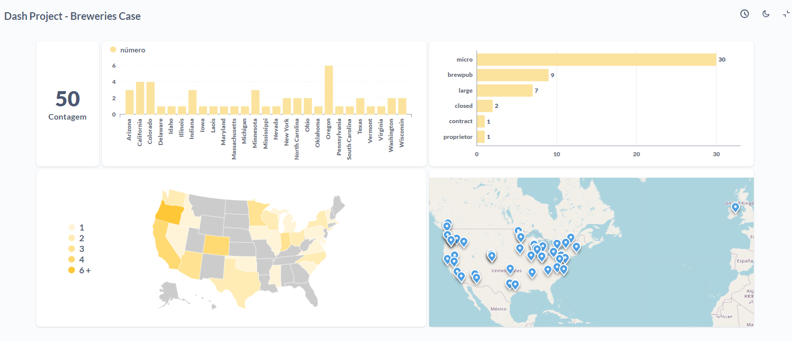

# BEES Data Engineering  
## 🍺 Projeto de Dados – Breweries Case

[](https://www.python.org/downloads/)  
[](http://localhost:8080)  
[](https://github.com/dsoliveria-lab/breweries_case/actions)

Este repositório apresenta um projeto de engenharia de dados cujo objetivo é demonstrar habilidades na extração de dados de uma API pública, tratamento e armazenamento em um data lake, seguindo a **arquitetura em camadas (medalhão)**:

- **Bronze**: dados brutos extraídos da API  
- **Silver**: dados limpos e particionados por localização  
- **Gold**: dados agregados e prontos para análise  

A solução integra ferramentas como **Apache Airflow**, **MinIO**, **PostgreSQL** e **Metabase**, além de ser orquestrada em ambiente **Docker**. O projeto também evidencia boas práticas com **Python**, versionamento de código e documentação clara.

💡 *Bons estudos e não se esqueça de beber água! 💦*

---

## 📊 Arquitetura da Pipeline

Abaixo está a representação visual da arquitetura implementada:


Nesta arquitetura, os dados semi-estruturados são extraídos de uma API e passam por camadas de transformação, armazenamento e visualização.

---

## 📁 Estrutura do Projeto

```bash
/BREWERIES_CASE
│
├── airflow/
│   ├── config_airflow/
│   │   ├── airflow.Dockerfile         # Dockerfile customizado para o Airflow
│   │   └── entrypoint.sh              # Entrypoint do container do Airflow
│   ├── dags/
│   │   ├── dag_main.py                # DAG principal: bronze → silver → gold
│   │   ├── dag_main_validation.py     # DAG alternativa com step de validação incluído
│   │   ├── dag_validation.py          # DAG dedicada à etapa de validação
│   │   └── variables/                 # Variáveis utilizadas pelo Airflow
│   ├── tasks/
│   │   ├── task_bronze.py             # Extração da API e salvamento na camada Bronze
│   │   ├── task_silver.py             # Transformações e particionamento por país na Silver
│   │   ├── task_gold.py               # Agregações na camada Gold
│   │   ├── task_silver_alt.py         # Versão alternativa de Silver
│   │   └── task_gold_alt.py           # Versão alternativa de Gold
├── docker-compose.yaml                # Orquestração dos serviços via Docker
├── .gitignore                         # Ignora arquivos desnecessários ao versionamento
├── requirements.txt                   # Bibliotecas Python utilizadas no projeto
├── README.md                          # Documentação do projeto
```

---

## 🧰 Tecnologias Utilizadas

- **API Open Brewery DB**: Fonte de dados pública, com informações sobre cervejarias nos EUA  
- **Apache Airflow**: Orquestração e agendamento das tarefas ETL  
- **Docker**: Ambiente conteinerizado e reprodutível  
- **MinIO**: Armazenamento compatível com S3, simula o Data Lake  
- **PostgreSQL**: Armazenamento relacional dos dados transformados  
- **Metabase**: BI para visualização das métricas produzidas  

---

## 🐳 Docker

O projeto é totalmente conteinerizado. O `docker-compose.yaml` configura todos os serviços, incluindo Airflow, MinIO, PostgreSQL e Metabase.

```bash
docker-compose up -d
```

---

## ⚙️ Airflow

- DAGs localizadas em `airflow/dags/`  
- Tarefas desacopladas e reutilizáveis em `airflow/tasks/`  
- Configurações customizadas no `airflow/config_airflow/`  

---

## 🗃️ MinIO

- Armazena os dados nas camadas **bronze**, **silver** e **gold**  
- Estrutura particionada por país na camada silver  
- Armazenamento em formato Parquet  

---

## 🗄️ PostgreSQL

- Banco relacional para consumo posterior em BI  
- Tabelas criadas automaticamente conforme cada camada  
- Utilizado também para validações e análises  

---

## 📊 Metabase

- BI conectado ao banco PostgreSQL  
- Dashboards com KPIs e insights por localidade e tipo de cervejaria  
- Controle de acesso configurável por grupo de usuários  

---

## 📈 Exemplos Visuais da Camada Gold



- Contagem de cervejarias por tipo e localidade  
- Visualização dos principais estados com maior número de cervejarias  
- KPIs configurados para análise rápida e tomada de decisão  

---

## 🚀 Como iniciar

1. Clone o repositório:  
   ```bash
   git clone https://github.com/dsoliveria-lab/breweries_case.git
   ```
2. Acesse o diretório do projeto:  
   ```bash
   cd breweries_case
   ```
3. Suba os containers com Docker:  
   ```bash
   docker-compose up -d
   ```
4. Acesse o Airflow:  
   ```
   http://localhost:8080
   ```
5. Após uso, remova os containers:  
   ```bash
   docker-compose down -v
   ```

---

## 📈 Melhorias Futuras

- **Testes automatizados:** Implementar testes unitários e de integração para as DAGs e tarefas  
- **Monitoramento:** Configurar alertas via Slack ou email para falhas no pipeline  
- **Escalabilidade:** Migrar armazenamento para S3 na nuvem e usar banco gerenciado para produção  
- **Documentação técnica:** Gerar documentação automática das DAGs e tarefas  
- **Pipeline CI/CD:** Automatizar deploy das DAGs via pipelines de integração contínua  

---

## 📚 Documentação Oficial

- [Apache Airflow](https://airflow.apache.org/docs/)  
- [Docker](https://docs.docker.com)  
- [MinIO](https://min.io/docs/kes/)  
- [Metabase](https://www.metabase.com/docs/latest/)
